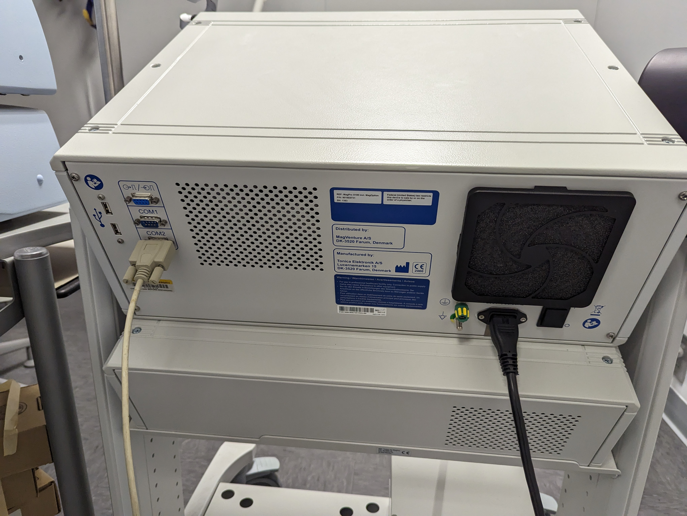
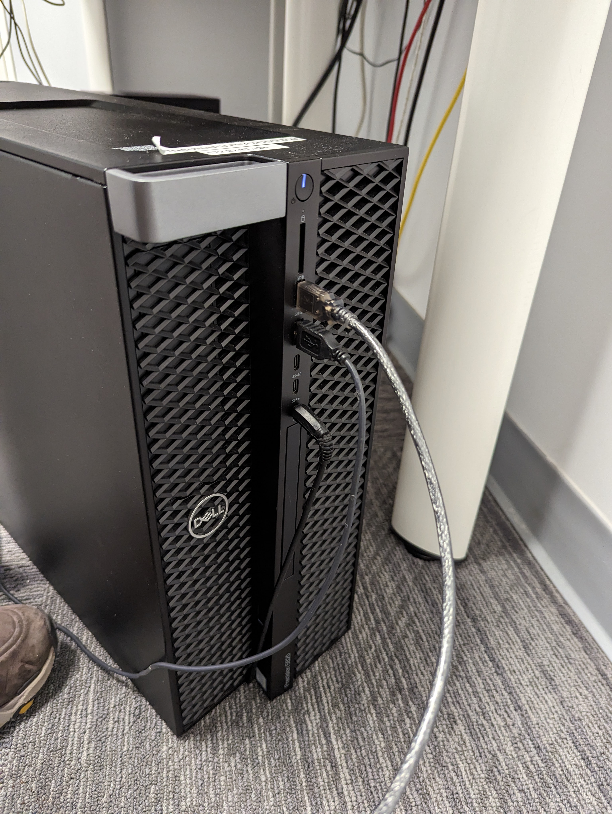

# EEG-TMS Triggers
This repository consists of codes borrowed from BrainProducts and MagVenture and modified to send triggers to EEG and TMS systems at Center for Brain Imaging (CBI) at NYU Department of Psychology.

The codes are made public for use, however, no guarantee for running on any system is provided. Feedback is appreciated to make the code more generalizable.

# EEG Trigger code:
## Triggerbox settings
The codes are tested to work on Ubuntu (to do: add version) as the stimulus presentation system. The stimulus presentation system is connected to BrainProducts Triggerbox via USB Male to MinDisplay Male cable, which is then connected to BrainVision ActiPower via DB-25 port. To ensure that triggers are received via stimulus PC, all 7 bits on Triggerbox should be set to PC. The specific settings for each bit (Low 1 vs High 1, Stimulus vs Response) can be changed in the from BrainVision Recorder (in Menu bar, look for Amplifier -> Digital Port Settings...).

## How to call the script?
BrainProducts Triggerbox has an FTDi Chip that creates a virtual serial port. However, if you are using Ubuntu, without appropriate drivers, the USB port will not be listed in /dev/. PyFtdi module of Python (https://eblot.github.io/pyftdi/) can be used to detect this serial port. Additionally, the hardware is only accessible to root. Therefore, in order to implement the script, from Terminal, you can execute the script as sudo:
> sudo python3 trigger_send.py 

If you are running the script from MATLAB, you can call it as:

> system('sudo python trigger_send.py')

In order to ensure that the script can run from the terminal, either run it from an account that has root access or add the script to sudoers. In order to add it to sudoers, from the account with root access, from Terminal run:
> sudo visudo

Scroll to the bottom of the sudoers file, add:

> username ALL=(ALL) NOPASSWD: /usr/bin/python3 /path_to_script/trigger_send.py

Replace "username" with the actual username of the user and "path_to_script" with the actual path to the python script. Save and close the file. Now the user "username" can run the Python script with root privelges without being prompted a password.

## Setting up BrainProducts device ID
First step is to obtain the device ID. Run the script as root as mentioned above and the error produced should give you the device ID. Replace
gpio1.configure('ftdi://Brainproducts.0x0021:TBXXXXXX/1', direction=0b11111111)
and
gpio2.configure('ftdi://Brainproducts.0x0021:TBXXXXXX/2', direction=0b00000000)
with the correct device ID.

To trigger the EEG system, you will mostly be using ports 0-7 which are triggered by:
gpio1 .write({trigger_code})

Note: This is a Python script. In order to run the script from MATLAB, you can simply run it as:
system('sudo python3 /path_to_script/trigger_send.py')

# TMS Trigger code:
The codes are meant to work with Ubuntu as the stimulus presentation system. The code uses "serial" function to detect and communicate with the serial port. However, this function works only for versions earlier than MATLAB 2019b. For later versions, the code needs to be modified with the updated function "serialport". This is a potential to-do for this repository.

## Device Setup:
MagVenture X100 is connected to stimulus presentation via DB-9 to DB-9 Null modem cable plus a serial to USB converter.

</img>
</img>
</img>

Make sure that the connections are right and TMS is connected to stimulus presentation PC via USB and not COM port as shown above.

## Triggering System
Trigger codes are present in "TMS.m" file. Refer to TMS.m for appropriate trigger codes. However, a general pipeline to send 1 pulse would be:

> s = TMS('Open') \
> TMS('Enable', s); \
> TMS('Main', s); \
> TMS('Amplitude', s, 33); % Sets amplitude to 33% MSO \
> TMS ('Single', s); \
> pause(1); \
> TMS ('Disable', s); \
> TMS('Close', s); 

Another example to send a train of pulses is:

> s = TMS('Open') \
> TMS('Enable', s); \
> TMS('Main', s); \
> TMS('Timing', s); % Use this page on TMS system to determine pulse protocol \
> TMS('Amplitude', s, 33); % Sets amplitude to 33% MSO \
> TMS ('Train', s); \
> WaitSecs(pulse_dur); % pulse_dur should be milliseconds \
> pause(1); \
> TMS ('Disable', s); \
> TMS('Close', s); 

WaitSecs requires Psychtoolbox so make sure Psychtoolbox is enabled. You can also run it without Psychtoolbox using pause instead of WaitSecs but that can be temporally less precise.

Run "timing_tester_TMS.m" script with your protocol to make sure the timing of the code matches your expected pulse duration.